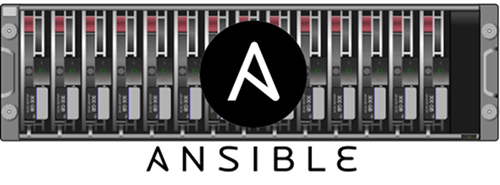
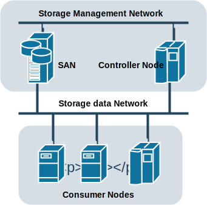

<p align="center">
  
</p>

Ansible Storage Role
====================

[](https://galaxy.ansible.com/Akrog/storage/)

The Ansible Storage Role is a vendor agnostic abstraction providing automation
for storage solutions and access provisioned resources.

Thanks to this abstraction it's now possible to write reusable playbooks that
can run on any of the supported storage arrays.

The role will provide an abstraction for multiple storage types:

- Block storage.
- Shared filesystems.
- Object storage.

Use cases:

- Automate provisioning of volumes for VMs managed via the
  [virt Ansible module](
  https://docs.ansible.com/ansible/latest/modules/virt_module.html).
- Take periodical snapshots of provisioned volumes.


Features
--------

The Storage Role currently supports block storage and has abstracted the
following operations.

- Get *backend* stats
- Create volumes
- Delete volumes
- Attach volumes
- Detach volumes


Concepts
--------

The Storage Role includes support for over 80 block storage drivers out of the
box, but this can be expanded creating a new storage provider.

A provider is the Ansible module responsible of carrying out operations on the
storage hardware.  Each provider must support at least one specific hardware
from a vendor, but it may as well support more, like the default provider does.

To expose the functionality of these providers, the Storage Role introduces the
concept of *backends*.  A *backend* is constructed passing a specific
configuration to a provider in order to manage a specific storage hardware.

There are two types of nodes in the Storage Role, *controllers* and
*consumers*.

<p align="center">
  
</p>

*Controllers* have access to the storage management network and can connect to
the storage hardware management network to control it.  For example to create
and export a volume.

*Consumers* only need access to the storage data network in order to connect
to the resources we have provisioned.  For example to connect a volume via
iSCSI.


Configuration
-------------

Before we can provision or use our storage, we need to setup the *controller*
node.

There are several configuration options that allow us to change default global
configuration for a provider's *controller* and *consumer* modules.  For now
we'll assume they have sensible defaults, so we'll only look at the
`storage_backends` configuration variable passed to the Storage Role.

The `storage_backends` is a dictionary providing the configuration for all the
*backends* we want a *controller* node to manage.  They keys of the dictionary
will be the identifiers for the *backends*, and they must be unique.

Example of how we can setup a node to manage an XtremIO array:

``` yml
- hosts: storage_controller
  vars:
    storage_backends:
      xtremio:
        volume_driver: cinder.volume.drivers.dell_emc.xtremio.XtremIOISCSIDriver
        san_ip: w.x.y.z
        xtremio_cluster_name: CLUSTER-NAME
        san_login: admin
        san_password: nomoresecrets
  roles:
      - {role: storage, node_type: controller}
```

Example
-------

Now that we have configured the *controller* node, we can start using the
*backend*, for example to provision and attach a new volume for each of our
consumer nodes:

``` yml
- hosts: storage_consumers
  roles:
      - {role: storage, node_type: consumer}
  tasks:
      - name: Create volume
        storage:
            resource: volume
            state: present
            size: 1

      - name: Connect volume
        storage:
            resource: volume
            state: connected
```

Getting started
---------------

Let's get you started on running your first Storage playbook.

First, install the role.

``` bash
$ ansible-galaxy install Akrog.storage
```

Create the inventory file `inventory`:

```
[storage_controller]
192.168.1.20

[storage_consumer]
192.168.1.20
192.168.1.21
```


Then run the role:

``` bash
$ cd ~/.ansible/roles/Akrog.storage/example
$ ansible-playbook lvm-backend.yml -i inventory
```
